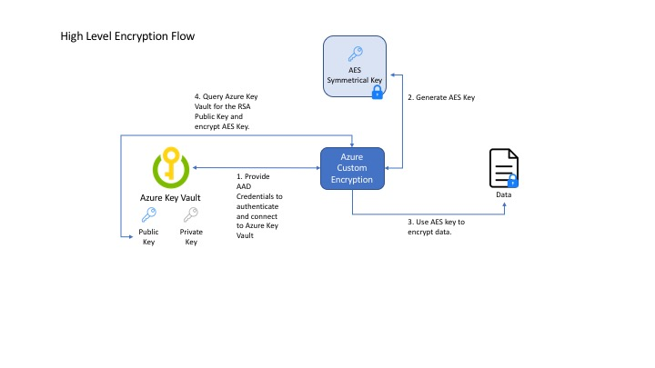
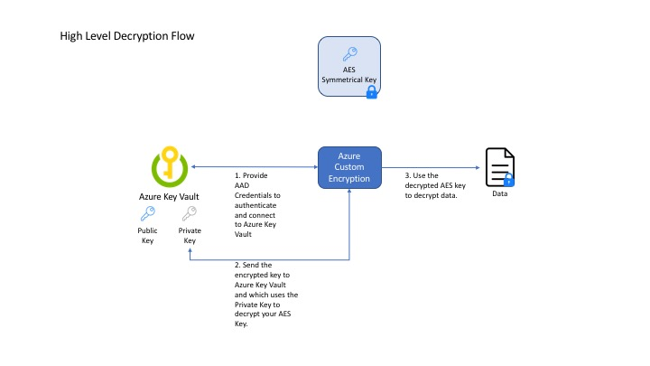

# Custom Data Encryption
[](https://travis-ci.org/Microsoft/custom-azure-data-encryption)

Azure Custom Data Encryption Library provides a light weight SDK for securing your encryption keys with asymetrical RSA keys.

## Installation

```bash
pip install git+https://github.com/microsoft/custom-azure-data-encryption.git
```

## High Level Overview

### Encryption


### Decryption


This encryption library seemlessly ties into Azure Key Vault for easy use!

### Quick Start

You can look at [demo.py](./samples/demo.py) for the reference on how to use this library.

## Tests

To run tests:

```bash
    pip install .
    pip install -r requirements.txt
    pytest
```

## Samples

### Prerequisites
- `python 2.7 or 3.6+`
- `virtualenv` for managing python packages between projects.


### Run Samples
1. Clone Respository

2. Create virtual environment using python 2.7 interpreter
    ```bash
    virtualenv --python=/usr/bin/python2.7 sample_virtual_env
    ```

3. Install Dependencies
    ```bash
    pip install .
    ```

5. Log in and use the Azure CLI
    ```bash
    az login
    To sign in, use a web browser to open the page https://microsoft.com/devicelogin and enter the code <Your Code> to authenticate.
    ```

6. Set the subscription you would like to provision the resources on
    ```bash
    az account set -s <Your Subscrition Name or Id>
    ```

7. Provision a `Service Principal` and `Key Vault` by running `deploy.sh`
    - Run `export` commands printed by the script when finished.
    ```bash
    bash scripts/deploy.sh
    Enter resource group name:
    sample-rg
    Enter key vault name:
    sample-kv
    Enter location (westus, westus2, eastus, ...):
    westus

    ...

    export AZURE_TENANT_ID=<guid>
    export AZURE_CLIENT_ID=<guid>
    export AZURE_CLIENT_SECRET=<guid>
    export VAULT_URI=<key_vault_uri>
    export KEY_NAME=sample-key
    export KEY_VERSION=<key_version>
    ```

8. Run Sample from root directory
    ```bash
    python samples/demo.py
    ```

# Contributing

This project welcomes contributions and suggestions.  Most contributions require you to agree to a
Contributor License Agreement (CLA) declaring that you have the right to, and actually do, grant us
the rights to use your contribution. For details, visit https://cla.microsoft.com.

When you submit a pull request, a CLA-bot will automatically determine whether you need to provide
a CLA and decorate the PR appropriately (e.g., label, comment). Simply follow the instructions
provided by the bot. You will only need to do this once across all repos using our CLA.

This project has adopted the [Microsoft Open Source Code of Conduct](https://opensource.microsoft.com/codeofconduct/).
For more information see the [Code of Conduct FAQ](https://opensource.microsoft.com/codeofconduct/faq/) or
contact [opencode@microsoft.com](mailto:opencode@microsoft.com) with any additional questions or comments.
